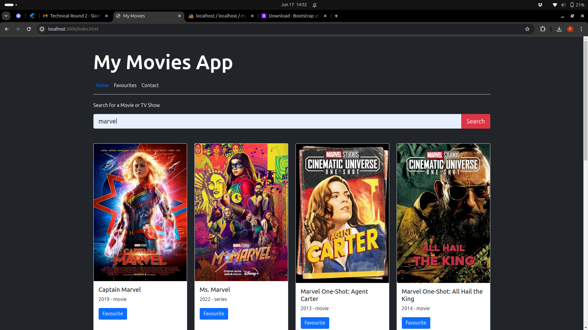
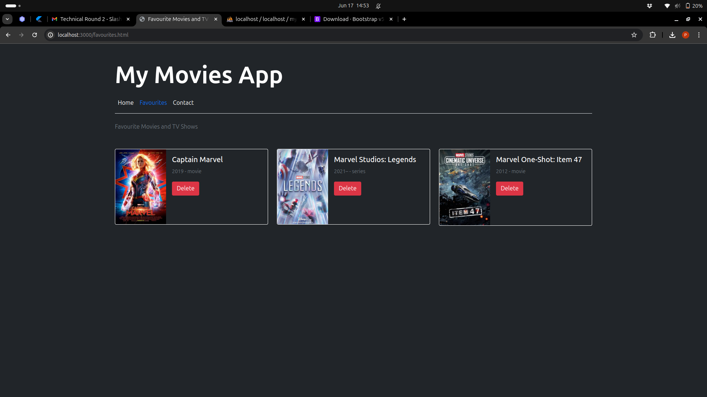

# My Movies App




This project is a simple web application that allows users to search for movies and TV shows using the OMDb API and manage their favorite selections.

## Features

- **Search:** Users can search for movies or TV shows using the search form on the home page.
- **Add to Favorites:** Users can add movies or TV shows to their favorites list by clicking the "Favourite" button.
- **View Favorites:** Users can view their favorite movies and TV shows on the "Favourites" page.
- **Delete from Favorites:** Users can delete items from their favorites list by clicking the "Delete" button next to each item.

## Technologies Used

- **Frontend:** HTML, CSS (Bootstrap 5), JavaScript (Fetch API)
- **Backend:** Node.js, Express.js
- **Database:** MySQL
- **External API:** OMDb API (for movie/TV show data)

## Packages Used

- **express:** Fast, unopinionated, minimalist web framework for Node.js.
- **body-parser:** Node.js body parsing middleware to parse incoming request bodies.
- **mysql:** Node.js driver for MySQL database.
- **axios:** Promise-based HTTP client for Node.js and the browser, used for making HTTP requests to OMDb API.
- **bootstrap:** Front-end component library for designing and building responsive websites.

## Installation

1. Clone the repository.
2. Install dependencies using `npm install`.
3. Set up your MySQL database and configure `config/dbConfig.js` with your database credentials.
4. Obtain an API key from [OMDb API](http://www.omdbapi.com/apikey.aspx) and replace `OMDB_API_KEY` in `controllers/searchController.js` with your API key.


## Setting Up MySQL Database

1. Install MySQL if you haven't already.
2. Create a new database named `my_movies_db`.
3. Set up the database schema using the following SQL script:

   ```sql
   CREATE TABLE IF NOT EXISTS favourites (
       id INT AUTO_INCREMENT PRIMARY KEY,
       title VARCHAR(255) NOT NULL,
       year VARCHAR(10),
       type VARCHAR(50),
       poster VARCHAR(255)
   );


### Code

A brief description of what this project does and who it's for

## 1. config/dbConfig.js

``` JavaScript []

const mysql = require('mysql');

const db = mysql.createConnection({
    host: 'localhost',
    user: 'root',
    password: '',
    database: 'my_movies_db'
});

db.connect(err => {
    if (err) {
        console.error('Database connection failed: ' + err.stack);
        return;
    }
    console.log('Connected to database.');
});

module.exports = db;


```

##### Configures and establishes a MySQL database connection for the application.

* Uses mysql package to create a connection to a MySQL database named my_movies_db on localhost.
* Exports the configured database connection (db) to be used throughout the application.


## 2. main.js

``` JavaScript []
const express = require('express');
const bodyParser = require('body-parser');
const path = require('path');

const app = express();
const port = 5000;

// Middleware setup
app.use(bodyParser.json());
app.use(bodyParser.urlencoded({ extended: true }));
app.use(express.static(path.join(__dirname, 'public')));

// Routing
const routes = require('./routes/index');
app.use(routes);

// Start server
app.listen(port, () => {
    console.log(`Server running on port ${port}`);
});

```

#### Initializes and configures the Express server
* body-parser for parsing JSON and URL-encoded request bodies.
* Static file serving from the public directory.
* Imports and uses routing defined in `routes/index.js`.
* Starts the server on port 5000 and logs a message upon successful start.

## 3. routes/index.js

``` JavaScript []
const express = require('express');
const router = express.Router();

// Importing route modules
const searchRoutes = require('./searchRoutes');
const favouriteRoutes = require('./favouriteRoutes');

// Mounting route modules
router.use(searchRoutes);
router.use(favouriteRoutes);

module.exports = router;

```


#### Handles routes for searching movies and TV shows.
* Imports searchController from ../controllers/searchController.js to handle search functionality.
* Defines a route /search that triggers the searchMovies function from searchController when accessed via GET request.
* Exports the router instance to be used in routes/index.js.


## 4. routes/favouriteRoutes.js

``` JavaScript []
const express = require('express');
const router = express.Router();
const favouriteController = require('../controllers/favouriteController');

// Routes for managing favorites
router.post('/favourite', favouriteController.addFavourite);
router.get('/favourites', favouriteController.getFavourites);
router.delete('/favourites/:id', favouriteController.deleteFavourite);

module.exports = router;
```

#### Defines routes for adding, retrieving, and deleting favorite movies and TV shows.

* Imports favouriteController from ../controllers/favouriteController.js to handle favorite management operations.
* POST /favourite for adding a favorite item.
* GET /favourites for retrieving all favorite items.
* DELETE /favourites/:id for deleting a favorite item by ID.


## 5. controllers/searchController.js

``` JavaScript []
const axios = require('axios');

const OMDB_API_KEY = '3f6a41b8';

exports.searchMovies = async (req, res) => {
    const query = req.query.q;
    try {
        const response = await axios.get(`http://www.omdbapi.com/?s=${query}&apikey=${OMDB_API_KEY}`);
        res.json(response.data);
    } catch (error) {
        res.status(500).send(error.message);
    }
};
```

#### Implements logic to fetch and return search results from the OMDb API
* Imports axios for making HTTP requests.
* Defines an asynchronous function searchMovies that accepts a query parameter (q) from the request.
* Uses axios.get to send a GET request to the OMDb API endpoint with the provided query and API key.
* Returns the JSON response data from the OMDb API or sends an error response with status code 500 if there's an error.


## 6. controllers/favouriteController.js

``` JavaScript []
const db = require('../config/dbConfig');

exports.addFavourite = (req, res) => {
    const { title, year, type, poster } = req.body;
    const sql = 'INSERT INTO favourites (title, year, type, poster) VALUES (?, ?, ?, ?)';
    db.query(sql, [title, year, type, poster], (err, result) => {
        if (err) {
            return res.status(500).send(err.message);
        }
        res.send('Favourite added successfully');
    });
};

exports.getFavourites = (req, res) => {
    const sql = 'SELECT * FROM favourites';
    db.query(sql, (err, results) => {
        if (err) {
            return res.status(500).send(err.message);
        }
        res.json(results);
    });
};

exports.deleteFavourite = async (req, res) => {
    const favouriteId = req.params.id;

    try {
        const deleteQuery = 'DELETE FROM favourites WHERE id = ?';
        await db.query(deleteQuery, [favouriteId]);
        res.sendStatus(200); 
    } catch (error) {
        console.error('Error deleting favourite:', error);
        res.status(500).json({ error: 'Failed to delete favourite' });
    }
};
```

#### Manages CRUD operations (Create, Read, Update, Delete) for favorite movies and TV shows stored in the MySQL database.
* Imports db from `../config/dbConfig.js` which establishes the MySQL database connection.
* addFavourite: Inserts a new favorite item into the favourites table.
* getFavourites: Retrieves all favorite items from the favourites table.
* deleteFavourite: Deletes a favorite item from the favourites table based on the provided ID.
* Uses db.query to execute SQL queries and handles errors appropriately.


